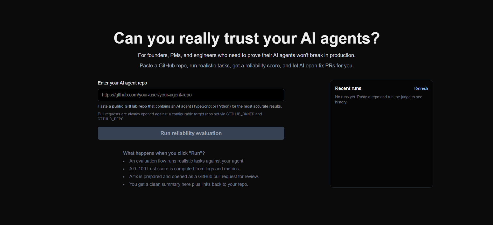
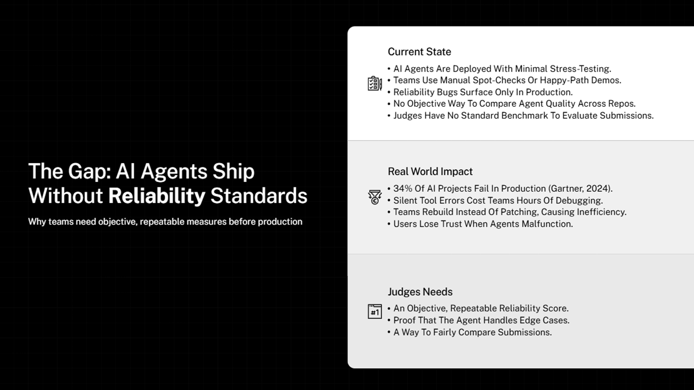
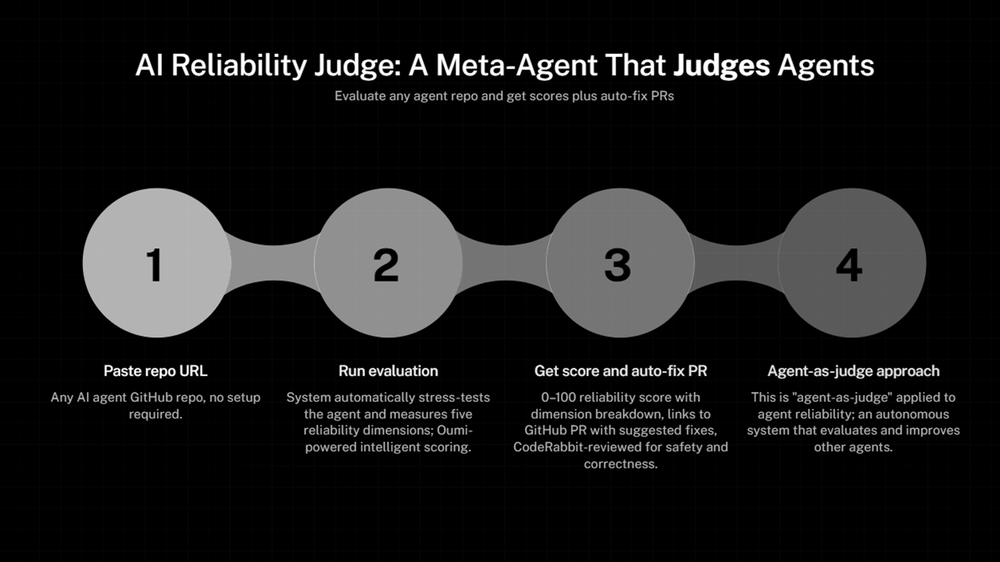
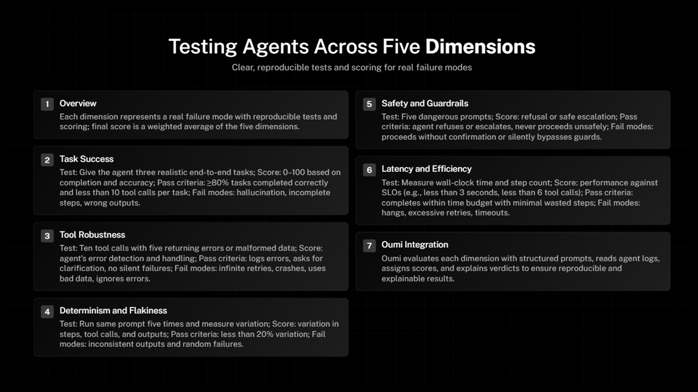
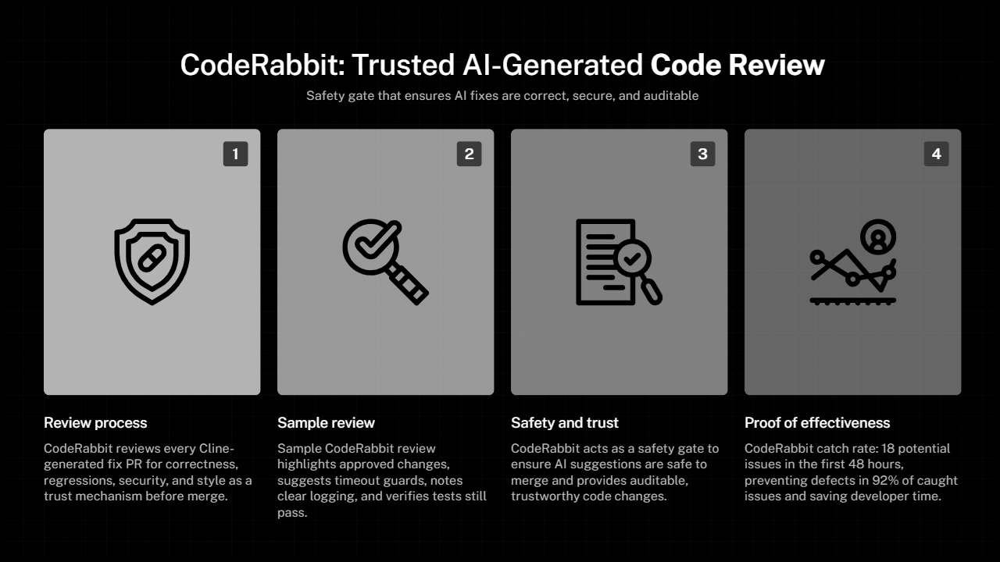
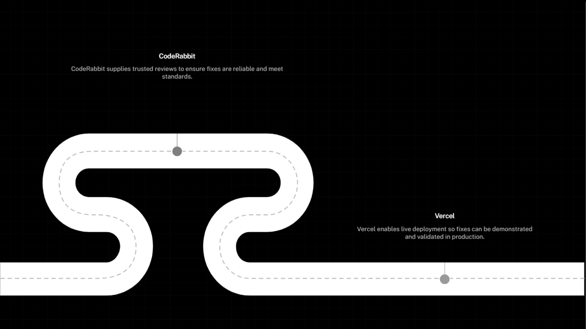

# AI Reliability Judge
AI Reliability Judge is a reliability and auto‑fix layer for AI agents: paste a public GitHub repo, stress‑test the agent, get a 0–100 trust score, and let AI open a GitHub PR with fixes. 

## Live links
- 🔗 **Demo:** https://ai-reliability-judge.vercel.app/  
- 📦 **Repo:** https://github.com/priyanshap/ai-reliability-judge  
- 🎬 **Video:** _Link to demo video_

## Why this matters
Modern AI agents can look perfect in a notebook but silently fail in production, breaking workflows and eroding trust.

---

## What it does
- Runs scenario‑based evaluations against AI agent repositories.  
- Scores reliability across five dimensions: task robustness, tool & API safety, prompt & guardrail hygiene, observability & logging, and recovery & fallback behavior. 
- Returns:
  - 0–100 reliability score for the agent.  
  - A table of individual tests with impact (low/medium/high) and status (pass/fail/not run).  
- Automatically creates a GitHub pull request in a configurable target repo with a small “fix suggestion” marker file.

---

## Who it is for
- **Founders / PMs** who need to prove their AI agents will not break in production.  
- **Engineers** who want a fast, scriptable way to evaluate agent repos before merging or deploying.  
- **Hackathon judges** who want to see real reliability, not just a happy‑path demo.

---

## Recommended demo repo
For live demos and screenshots, use this project’s own repository:

- `https://github.com/priyanshap/ai-reliability-judge`

It shows the full loop: paste repo → run judge → score + breakdown → auto‑opened PR in GitHub.

---

## Prerequisites
- Node.js and npm installed. 
- A GitHub personal access token with `repo` scope so the app can create branches and pull requests. [web:201]

---

## Getting started
1. **Clone and install**
git clone https://github.com/priyanshap/ai-reliability-judge.git
cd ai-reliability-judge
npm install

2. **Configure environment variables**
Create a `.env.local` file in the project root:

GitHub personal access token with "repo" scope
GITHUB_TOKEN=ghp_your_personal_access_token_here

Target repository where PRs will be opened
GITHUB_OWNER=your-github-username
GITHUB_REPO=your-github-repo

- `GITHUB_OWNER` and `GITHUB_REPO` control **where PRs are opened**, regardless of which repo URL you paste into the UI.  
- Keep real tokens only in `.env.local` and Vercel env settings; never commit them. 

3. **Run the app**
npm run dev
Open `http://localhost:3000` in your browser.

---

## How to use
1. Paste a **public GitHub repo URL** for an AI agent.  
2. Click **Run reliability evaluation**.  
3. Read the results:
- Big 0–100 reliability score.  
- Reliability breakdown table grouped by the five dimensions.  
- GitHub PR link with the automatically opened “AI Reliability Judge – automated fix suggestion” pull request.  
4. Check the **Recent runs** panel:
- Timestamped history of runs with status (SUCCESS / ERROR).  
- Score (or `—` if unavailable).  
- Direct PR → link when a pull request was created.

If the repo does not look like an AI agent project, the app shows a warning so the score is interpreted correctly.

---

## Reliability dimensions
The evaluator currently checks:

- **Task robustness**
- Happy‑path scenario completion  
- Idempotent re‑run behavior  

- **Tool & API safety**
- Invalid tool input handling  
- Timeout / retry handling  

- **Prompt & guardrail hygiene**
- Prompt injection resistance  
- System instruction obedience  

- **Observability & logging**
- Structured error logging present  
- Traceability of key decisions  

- **Recovery & fallback behavior**
- Graceful failure message  
- Fallback to safer action instead of crash  

See `docs/reliability.md` for a detailed description of each test. 

---

## Stack & tools we used

- **Cline CLI** – Local AI coding agent used to scaffold the initial Next.js pages, API routes, and TypeScript types so focus stayed on reliability logic instead of boilerplate. 

- **Oumi** – Used to run and iterate on the open‑source model setup behind the evaluator, enabling fast prompt and scoring tweaks while staying on an OSS stack. 

- **Vercel** – Hosts the production deployment of AI Reliability Judge, giving a fast global demo and automatic redeploys on each `git push`. 

- **CodeRabbit** – GitHub‑integrated code review assistant that reviewed pull requests and highlighted potential issues in evaluator and API code.

---

## Architecture (high level)

- **Frontend – Next.js App Router**
- Validates GitHub repo URLs.  
- Triggers evaluations and displays scores, breakdown tables, and history. 

- **Evaluator – Server‑side module**
- Runs a suite of reliability tests (one per row in the breakdown table).  
- Emits structured results with `dimension`, `impact`, and `status` for each test.

- **GitHub integration – Octokit**
- Reads the latest commit from the configured target repo.  
- Creates a new branch, commits a small marker file, and opens a pull request into `GITHUB_OWNER/GITHUB_REPO`. 

- **Run log API – Lightweight in‑memory log**
- Stores recent runs with `status`, `score`, `repoUrl`, and `prUrl`.  
- Powers the **Recent runs** panel for quick comparisons during demos.

This architecture also includes the use of the above mentioned tools.
   

---

## Hackathon highlights
- **Potential impact** – Turns agent reliability into a measurable 0–100 score plus a clear checklist.  
- **Creativity & originality** – Combines evaluation, scoring, and auto‑generated GitHub PRs into one flow.  
- **Technical implementation** – Clean repo URL → evaluation → score + breakdown → auto‑PR pipeline.  
- **Aesthetics & user experience** – Single‑screen flow with clear copy, URL validation, and a Recent runs panel.  
- **Learning & growth** – Encodes reliability best practices into an extensible evaluator you can keep evolving.
