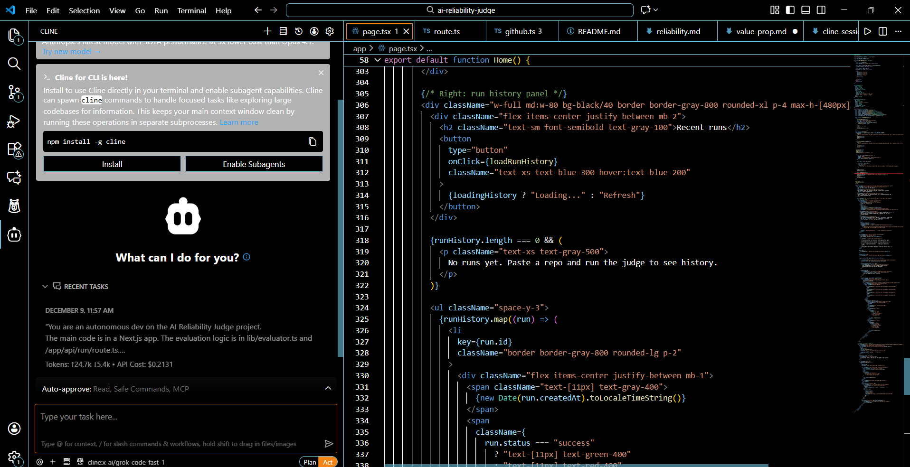

# Cline CLI session log (summary)
- Task: “Set up a Next.js page with a left‑side form to paste a GitHub repo URL and a right‑side panel for recent runs. Hook the form to an `/api/run` route that returns a mock reliability score.”
  - Outcome: Cline generated the page, API route, and basic fetch logic; then it iterated to fix TypeScript errors and improve loading states.

- Task: “Add a GitHub PR link to the results view using a `prUrl` field from the API response.”
  - Outcome: Cline updated the result card to render a call‑to‑action button, plus simple error handling if the URL is missing.

You can see an example Cline CLI session in the screenshot below, where it refactors the evaluator API route.

